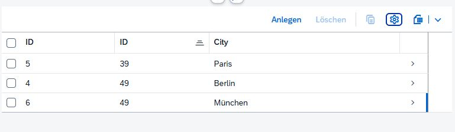
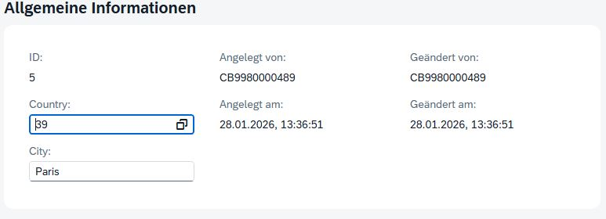
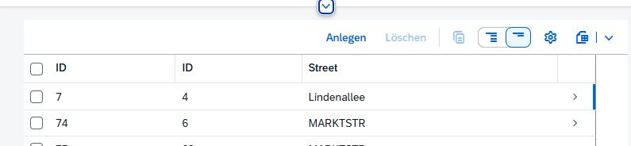
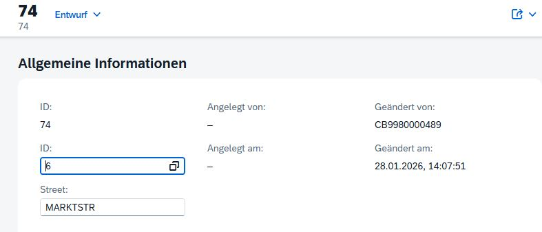
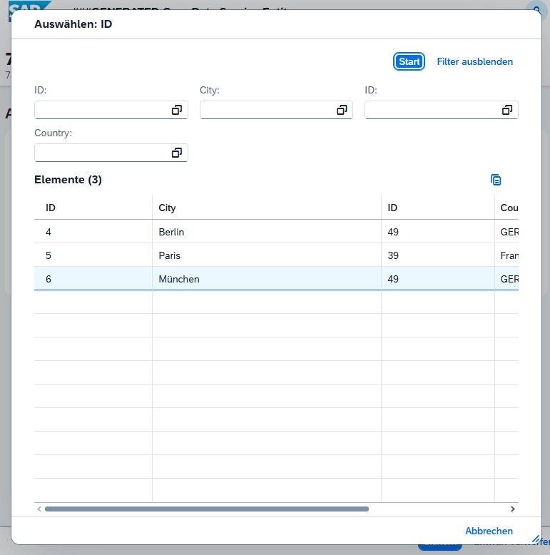

# SAPZPFAF1
SAP ABAP 

---

What have beed realised
ZPFAF1
* ZTBL_2COUNTRY, ZTBL_2CITY, ZTBL_2STREET - tables for data 
every table have standalone bussines OData-UI service in the internal Package ZPFAF1_RAP2

the number range for generation of uniques keys for the tables ZTBL_2CITY, ZTBL_2STREET.

In the edit of the country could be use the search form

Same search form for the change of the city

-----
DAdi realisation for two interfaces ZIF_SUM and ZIF_MUL.

By the name of interface call the interface-specific function for sum or for mul.

